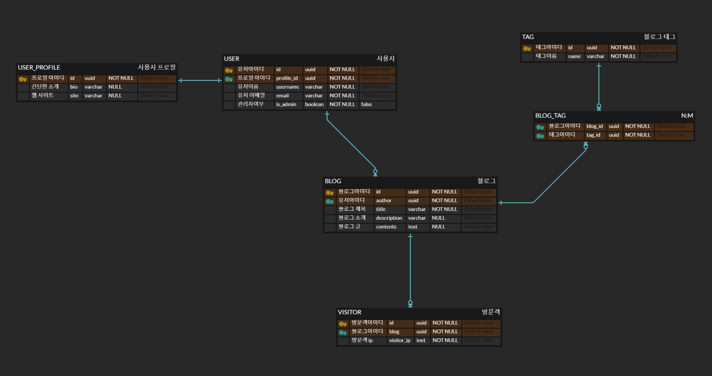

# Nestjs TypeORM Toy Project

TypeORM과 실무를 익히기 위한 NestJs 공부용 토이 프로젝트

## Env

- Versions

  - node v20.11.0
  - npm 10.2.4
  - yarn 1.22.21
  - typescript 5.3.3

- VSCode Settings

  ```json
  {
    "workbench.colorTheme": "Default Dark+",
    "editor.formatOnSave": true,
    "editor.codeActionsOnSave": {
      "source.fixAll": "explicit"
    },
    "editor.defaultFormatter": "esbenp.prettier-vscode"
  }
  ```

- Added eslintrc.js Settings

  ```js
  rules: {
  	<!-- [lf -> auto] Delete `␍` eslint (prettier/prettier) -->
  	'prettier/prettier': [
  		'error',
  		{
  			endOfLine: 'auto',
  		},
  	],
  	<!-- [error -> warn] 'A' is declared but its value is never read. ts(6133) -->
  	'@typescript-eslint/no-unused-vars': 'warn'
  }
  ```

- Added Modules

  - **nest-js/config**: `yarn add @nestjs/config`
  - **validation**: `yarn add class-validator class-transformer`
  - **[_joi_](https://github.com/hapijs/joi)**: `yarn add joi`
  - **typeorm + postgres**: `yarn add pg typeorm typeorm-naming-strategies @nestjs/typeorm`
  - **[_cookie-parser_](https://docs.nestjs.com/techniques/cookies)**: `yarn add cookie-parser`, `yarn add -D @types/cookie-parser`

- .env for local

  ```text
  # app
  NODE_ENV=development
  PORT=8080
  ADMIN_USER=admin
  ADMIN_PASSWORD=1q2w3e4r5t
  SECRET_KEY=secretkey1234
  DB_USERNAME=testuser
  DB_PASSWORD=P@ssw0rd
  DB_HOST=localhost
  DB_PORT=5433
  DB_NAME=testdb

  # db
  POSTGRES_DB=testdb
  POSTGRES_USER=testuser
  POSTGRES_PASSWORD=P@ssw0rd
  ```

- docker
  ```shell
  docker-compose up -d
  ```

## Project ERD



## Installation

```bash
$ yarn install
```

## Running the app

```bash
# development
$ yarn run start

# watch mode
$ yarn run start:dev

# production mode
$ yarn run start:prod
```

## Test

```bash
# unit tests
$ yarn run test

# e2e tests
$ yarn run test:e2e

# test coverage
$ yarn run test:cov
```

## Ref

- [_teaching-typeorm-in-the-nest code_](https://github.com/amamov/teaching-typeorm-in-the-nest)
- [_jest for test_](https://archive.jestjs.io/docs/en/22.x/getting-started)
- [_TypeORM: Active Record vs Data Mapper Pattern_](https://typeorm.io/active-record-data-mapper#what-is-the-active-record-pattern)
  - **Active Record Pattern**: 레포지토리 레이어를 두지 않고 엔터티 자체에서 직접 접근하여 로직을 수행합니다. 비교적 작은 서비스에 어울리는 패턴입니다. 모든 엔터티들은 TypeORM에서 제공하는 BaseEntity를 상속하고 이 BaseEntity에는 대부분의 기본 레포지토리에서 제공하는 메서드들이 담겨있습니다.
  - **Data Mapper Pattern**: 엔터티에 직접 접근하는 방식이 아닌 레포지토리 레이어를 두고 접근합니다.
- [_TypeORM: Relations_](https://typeorm.io/relations)
